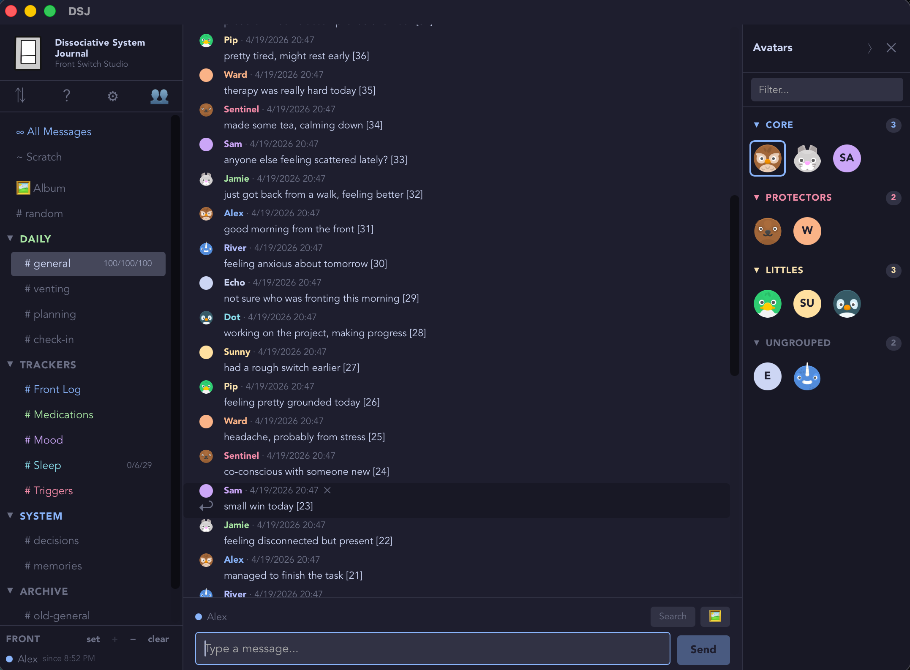
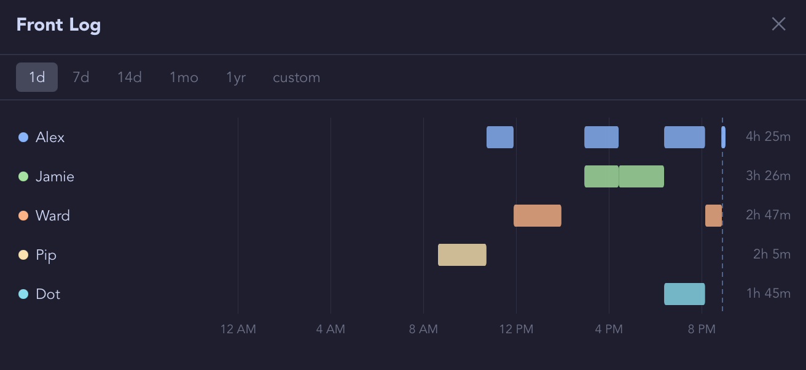
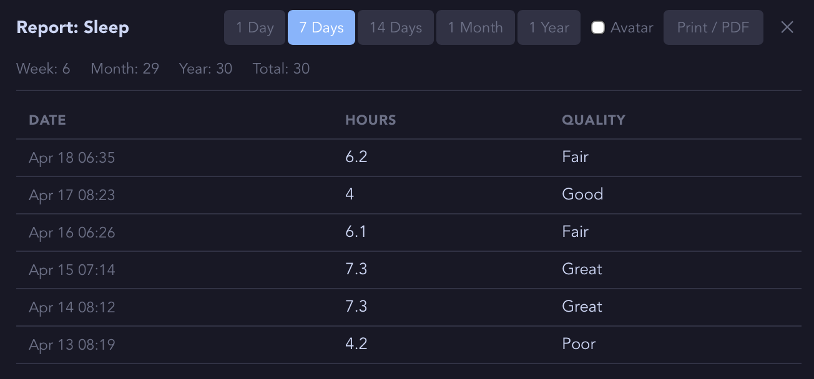

# DissociativeSystemJournal (DSJ)

A local, private desktop journal for dissociative systems.

Built by a system, for systems.

---

## What it is

DSJ is a place for your system to write, track, and reflect — without sending your data anywhere.

- **Multiple avatars** — each message and entry is attributed to whoever is writing. Add custom properties and notes.
- **Channels** — organize conversations and logs by topic
- **Front Tracking** - see the trends
- **Structured logs** — track emotions, body sensations, safety, medications, or anything else in user-defined tables. And view the summary reports.
- **Searchable** - DSJ uses Full-Text Search version 5 and filters to find the data you want. Look at the All Message channel to read the latest messages without having to look everywhere.
- **Import tools** - Want to import from Simply Plural. Done.
- **Local only** — no account, no cloud, no telemetry. Your data lives in an encrypted SQCipher database on your machine.
- **Yours** — export everything to documented JSON format any time. Back up with one click. Modify the database or the tool source. 

## Not a therapy tool
DSJ is a personal journaling and tracking tool. It is not a clinical product, not a substitute for therapy,
nor professional support, and not designed for crisis intervention. 
If you are in crisis, please reach out to a crisis line or mental health professional. 

<table width="100%">
  <tr>
    <td width="33%"></td>
    <td width="33%"></td>
    <td width="33%"></td>
  </tr>
  <tr>
    <td align="center">Channels, chat, alters.</td>
    <td align="center">Track alters</td>
    <td align="center">Create custom trackers</td>
  </tr>
</table>

---

## Why

Simply Plural is shutting down in 2026 and I had to extract my data and find a new home. A lot of systems are looking for somewhere to go.

DSJ is not a direct replacement — it doesn't have social sharing, and it doesn't try to. It's built around a different idea: my system needs a data vault with journaling, tracking, and tools for understanding myself over time.

If that's what you need, this might be for you. It is what my system needs.

I believe in using tools. Claude Code happens to be a tool. Claude helps me everyday and is in the credits for both its code and its conversations. If you have issues with AI, this project is probably not the place for you.


---

## Status

Early Access. Used daily by the system that built it. Rough edges exist.

| Version | Status | Focus |
|---------|-------|----|
| v0.9 | Now | First public release — this version ✓ |
| v1.0 | Soon | Stability — a few weeks of real use, bug fixes |
| v1.1 | I need it! | iOS support and Peer to Peer sync |
| v1.2 | Planned | Reminders and Polls |

Help out by reporting issues and requestion features!
[open an issue](https://github.com/FrontSwitch/ds-journal/issues)

---

## Building from source

DSJ is a [Tauri](https://tauri.app) app. You need:

- [Rust](https://rustup.rs) (install via rustup)
- [Node.js](https://nodejs.org) 18 or later
- macOS (Windows/Linux not tested yet)

```bash
git clone https://github.com/FrontSwitch/dsj.git
cd dsj
npm install
npm run tauri dev
```

First run compiles Rust dependencies — takes a few minutes. Subsequent runs are fast.

To run against any arbitrary DB:
```bash
DSJ_DB=/path/to/custom.db npm run tauri dev
```

## Running 
```bash
cd <folder>
npm run tauri dev        # normal run against production DB
npm run dev:test         # run against test DB (seed it first)
npm run seed:test        # (re)create test DB with sample alters channels
npm run delete:test      # wipe the test DB
npm run seed:load -- --messages 5000       # populate a load test volume with N messages
```
---

## Importing from Simply Plural

If you have SP exports (.txt files):

```bash
cp scripts/import-map.example.json scripts/import-map.json
# edit import-map.json — map your SP names to DSJ names
# place your .txt exports in the output/ directory

node scripts/import.cjs             # preview (dry run — nothing written)
node scripts/import.cjs --import    # actually import
```

If import fails, you can send us the info...safely without your info.
Takes out the text and dates.
```bash
npm run sp:anonymize     # export.json → test-export.json
```

---

## Your data

- **Database:** `~/Library/Application Support/io.github.frontswitch.dsj/dsj.db` (SQLite)
- **Backups:** `~/Library/Application Support/io.github.frontswitch.dsj/backups/`
- **Export:** Settings → Backup & Export → Export to JSON

The database is a standard SQLite file. You can open it with any SQLite browser. You don't need DSJ to read your own data.


---

## Privacy

I don't want my data shared. You might not either.
- No account
- No cloud save
- No telemetry

---

## Contributing

Early days. If you're a system and you want to help shape what gets built — what you track, what you need, what doesn't work — issues and conversations are welcome.

If you're a developer, read `CLAUDE.md` for the full technical picture. There's some other markdown files that might help (ROADMAP.md, IOS.md)

---

## Credits

See the About screen inside the app — click **DSJ** in the top left corner.

---

## License

MIT - LICENSE.md
